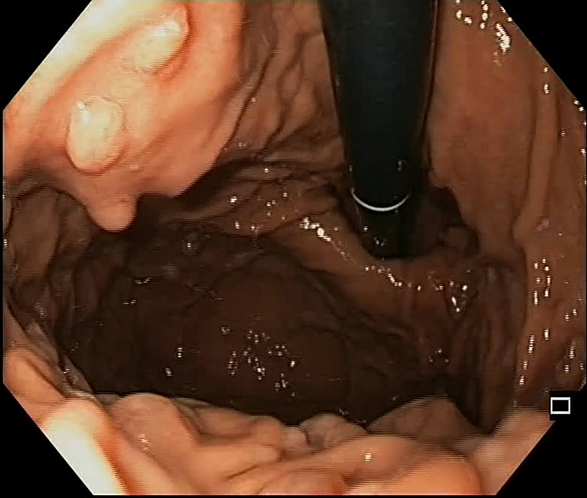

# 🩺 GastroVision
### *AI-Assisted Endoscopic Insight*

  <b>A premium, modern clinical assistant that adds an explainable, deep learning-based diagnostic support layer to gastrointestinal image review workflows.</b>

---

---

## 🌟 Key Features

*   **⚡ Multi-Class Classification**  
    Automatically detects and classifies findings across six key clinical categories: **Cancer, GERD, GERD Normal, Polyp, Polyp Normal, and Spot**.

*   **🌀 Interactive Scanning Radar**  
    Implements a responsive, simulated scan view driven by an animated CSS conic-gradient radar sweep that activates during active requests.

*   **🤗 Direct Hugging Face Inference**  
    Direct API connection using the official `@gradio/client` SDK to query the `maxiu-uzumaki/gastroVision` AI Space on the fly.

*   **🛡️ Secure Serverless Contact Engine**  
    Handles doctor and lead inquiries using secure serverless edge functions proxying the **Resend API**, preventing CORS issues and keeping credentials private.

*   **✨ Premium Tailored UX/UI**  
    Crafted with a warm-toned neutral color scheme, smooth custom-styled scrollbars, fully responsive bento grid features, and micro-interactions.

---

## 🛠️ Technology Stack

| Component | Technology | Description |
| :--- | :--- | :--- |
| **Frontend Core** | `React 18+` | Single Page Application framework |
| **Build Engine** | `Vite` | Instant HMR and lightning-fast production bundling |
| **Styling** | `Vanilla CSS3` | Responsive bento structures, HSL custom properties, and keyframe animations |
| **Machine Learning** | `@gradio/client` | Client interface for remote Hugging Face neural net inference |
| **Email Proxy** | `Resend SDK` | Transactional email engine routed through edge functions |

---

## ☁️ Live Production Deployment

The application is built, optimized, and served globally on the edge:

👉 **[https://gastrovision.pages.dev](https://gastrovision.pages.dev)** 👈

---

## ⚖️ License

Distributed under the MIT License. See [LICENSE](LICENSE) for more information.
